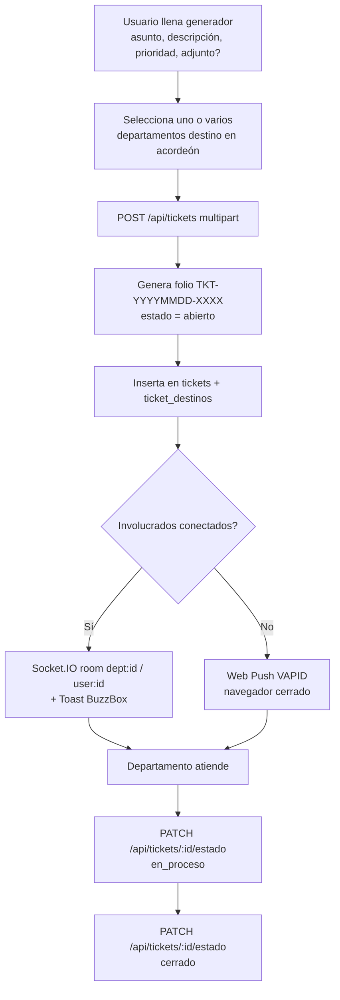

# Lógica del Sistema — Sistema de Tickets Interno ULTRA

Documento técnico que describe la arquitectura, el modelo de datos, los flujos de autenticación y de tickets, la estrategia de cache-busting y las medidas de seguridad del **Sistema de Tickets Interno ULTRA**.

- **Ubicación:** `F:/TicketInterno/TKT` (servidor Windows).
- **Backend:** Fastify en `http://localhost:3080`.
- **Base de datos:** SQLite nativa (`node:sqlite`) en `./data/tickets.db` (modo WAL).
- **Hashing de contraseñas:** `node:crypto` con **scrypt**.
- **Runtime:** Node.js v22+ (probado en v24.18.0).

---

## Índice

1. [Arquitectura](#1-arquitectura)
2. [Modelo de datos](#2-modelo-de-datos)
3. [Flujo de autenticación](#3-flujo-de-autenticación)
4. [Flujo de creación de ticket y notificación](#4-flujo-de-creación-de-ticket-y-notificación)
5. [Diagrama del ciclo de un ticket](#5-diagrama-del-ciclo-de-un-ticket)
6. [Estrategia de cache-busting](#6-estrategia-de-cache-busting)
7. [Seguridad](#7-seguridad)

---

## 1. Arquitectura

Un único proceso **Fastify** en el puerto **3080** cumple todas las responsabilidades del servidor:

| Responsabilidad | Detalle |
|-----------------|---------|
| Splash | Sirve la pantalla de arranque de 2s con logo ULTRA |
| Estáticos | Sirve la interfaz (HTML/CSS/JS) vía `@fastify/static` |
| API REST | Rutas bajo `/api/*` |
| Tiempo real | Servidor **Socket.IO** montado sobre el mismo proceso |
| Web Push | Envío de notificaciones VAPID con `web-push` |

**Frontend:** Tailwind + DaisyUI (temas `ultralight`/`ultradark`) y el cliente de Socket.IO se cargan por **CDN**. La marca aplica logo redondo de 80px arriba-izquierda, palabra "ULTRA" en Arial Black, paleta gris `#9A9A9A`, rojo vivo `#E30613`, negro `#1A1A1A`, blanco `#FFF`, y footer con derechos y correo de soporte.

**BuzzBox:** librería **propia** del sistema para toasts, modales, confirms, prompts, loaders y progress. Ningún cuadro emergente proviene del navegador.

```
                 ┌─────────────────────────────────────────────┐
   Navegador ───▶│  Fastify :3080                              │
   (Tailwind/     │  ├─ Splash + estáticos (@fastify/static)   │
   DaisyUI/       │  ├─ API REST  /api/*                       │
   Socket.IO      │  ├─ Socket.IO (rooms user:{id}, dept:{id}) │
   client CDN)    │  └─ Web Push (VAPID / web-push)            │
                 │            │                                │
                 │            ▼                                │
                 │  SQLite nativa (node:sqlite) WAL            │
                 │  ./data/tickets.db                          │
                 └─────────────────────────────────────────────┘
```

---

## 2. Modelo de datos

Base de datos SQLite (`./data/tickets.db`, WAL). Tablas principales y relaciones:

### `usuarios`
| Columna | Tipo | Notas |
|---------|------|-------|
| id | INTEGER PK | Identificador |
| correo | TEXT UNIQUE | `@corporativoultra.com` |
| nombre | TEXT | Nombre completo capturado en primer ingreso |
| telefono | TEXT | Contraseña inicial deriva de aquí |
| password_hash | TEXT | scrypt (`node:crypto`) |
| rol | TEXT | `usuario` \| `master` |
| departamento_id | INTEGER FK → departamentos.id | Departamento del usuario |
| primer_ingreso | INTEGER (0/1) | Obliga captura de nombre + cambio de clave |
| activo | INTEGER (0/1) | Baja lógica / reactivación |

### `departamentos`
| Columna | Tipo | Notas |
|---------|------|-------|
| id | INTEGER PK | |
| nombre | TEXT | Operaciones, Calidad, RH, etc. |
| activo | INTEGER (0/1) | Alta/baja gestionable |

### `tickets`
| Columna | Tipo | Notas |
|---------|------|-------|
| id | INTEGER PK | |
| folio | TEXT UNIQUE | `TKT-YYYYMMDD-XXXX` |
| asunto | TEXT | |
| descripcion | TEXT | Texto libre |
| prioridad | TEXT | `baja` \| `media` \| `alta` |
| adjunto | TEXT | Ruta del archivo opcional |
| estado | TEXT | `abierto` \| `en_proceso` \| `cerrado` |
| autor_id | INTEGER FK → usuarios.id | Autor |
| creado_en | TEXT/DATETIME | Fecha y hora de creación |
| actualizado_en | TEXT/DATETIME | Última modificación de estado |

### `ticket_destinos`
Relación **muchos-a-muchos** entre tickets y departamentos (soporta múltiples destinos).
| Columna | Tipo | Notas |
|---------|------|-------|
| ticket_id | INTEGER FK → tickets.id | |
| departamento_id | INTEGER FK → departamentos.id | |

### `bitacora`
| Columna | Tipo | Notas |
|---------|------|-------|
| id | INTEGER PK | |
| usuario_id | INTEGER FK → usuarios.id | Puede ser nulo en intentos |
| accion | TEXT | login, logout, primer_ingreso, etc. |
| detalle | TEXT | Descripción del evento |
| creado_en | TEXT/DATETIME | Marca temporal |

### `push_subscriptions`
| Columna | Tipo | Notas |
|---------|------|-------|
| id | INTEGER PK | |
| usuario_id | INTEGER FK → usuarios.id | |
| endpoint | TEXT | Endpoint del navegador |
| p256dh | TEXT | Clave pública del cliente |
| auth | TEXT | Secreto de autenticación |

### `sesiones`
| Columna | Tipo | Notas |
|---------|------|-------|
| id | INTEGER PK | |
| usuario_id | INTEGER FK → usuarios.id | |
| jti | TEXT PK | Identificador del JWT |
| ultima_actividad | TEXT/DATETIME | Base del control server-side de inactividad |
| revocada | INTEGER (0/1) | Revocación de sesión |

### `config`
| Columna | Tipo | Notas |
|---------|------|-------|
| clave | TEXT PK | p. ej. `build_id`, `pin_altas` |
| valor | TEXT | Valor de configuración |

**Relaciones resumidas:**
- `usuarios.departamento_id → departamentos.id`
- `tickets.autor_id → usuarios.id`
- `ticket_destinos.ticket_id → tickets.id`, `ticket_destinos.departamento_id → departamentos.id`
- `bitacora.usuario_id → usuarios.id`
- `push_subscriptions.usuario_id → usuarios.id`
- `sesiones.usuario_id → usuarios.id`

---

## 3. Flujo de autenticación

Autenticación basada en **JWT con `jti`** respaldada por la tabla `sesiones`, con control de **inactividad en servidor** además del cliente.

1. **Login** (`POST /api/auth/login`): el usuario envía correo + contraseña. El servidor valida el hash **scrypt**. Si es correcto, emite un **JWT con `jti`**, crea un registro en `sesiones` y escribe en `bitacora`.
2. **Primer ingreso** (`POST /api/auth/primer-ingreso`): si `primer_ingreso = 1`, se obliga a capturar nombre completo y a cambiar la clave mediante un modal BuzzBox.
3. **Cambio de clave** (`POST /api/auth/cambiar-clave`): actualiza `password_hash` con scrypt.
4. **Sesión activa** (`GET /api/auth/me`): devuelve datos del usuario autenticado.
5. **Ping de actividad** (`POST /api/auth/ping`): cada actividad relevante actualiza `sesiones.ultima_actividad`.
6. **Inactividad (doble capa):**
   - **Cliente:** temporizador de 20 min que cierra sesión y login.
   - **Servidor:** si `ultima_actividad` supera 20 min, la sesión (`jti`) se invalida y las peticiones se rechazan.
7. **Logout** (`POST /api/auth/logout`): marca la sesión como inactiva y registra en bitácora.

Tras un login válido se muestra la **bienvenida con nombre completo, fecha y hora**.

---

## 4. Flujo de creación de ticket y notificación

1. El cliente envía `POST /api/tickets` como **multipart** (para permitir el adjunto opcional).
2. El servidor genera el **folio** `TKT-YYYYMMDD-XXXX`, inserta en `tickets` con estado `abierto` y registra los destinos en `ticket_destinos`.
3. **Notificación en tres vías:**
   - **Socket.IO:** se emite a la room `dept:{id}` de cada departamento destino y a la room `user:{id}` de los involucrados.
   - **Toast BuzzBox:** los usuarios conectados reciben el aviso visual.
   - **Web Push (VAPID):** para navegadores cerrados, usando las suscripciones de `push_subscriptions`. Actúa como **fallback** cuando el usuario no está conectado por Socket.IO.
4. El cambio de estado se realiza con `PATCH /api/tickets/:id/estado` (`abierto → en_proceso → cerrado`).

**Rooms de Socket.IO:**
- `user:{id}` — canal personal de cada usuario.
- `dept:{id}` — canal por departamento destino.

---

## 5. Diagrama del ciclo de un ticket



---

## 6. Estrategia de cache-busting

- Al iniciar, el cliente compara su versión contra `GET /api/version` mediante un **`build_id`**. Si difiere, **limpia la caché** y recarga.
- El **Service Worker** usa `skipWaiting()` y `clients.claim()` para activarse de inmediato.
- El Service Worker **no cachea HTML ni respuestas de API**, evitando servir vistas o datos obsoletos.

---

## 7. Seguridad

| Medida | Implementación |
|--------|----------------|
| Cabeceras seguras | `@fastify/helmet` |
| Límite de peticiones | `@fastify/rate-limit` |
| Hash de contraseñas | `node:crypto` **scrypt** |
| Sesiones y tokens | JWT con `jti` + tabla `sesiones`, revocables |
| Inactividad | Doble capa cliente + servidor (20 min) |
| Cookies | `@fastify/cookie` |
| Operaciones sensibles | **PIN 1033** para alta/baja de usuarios (solo masters) |
| Bitácora | Registro de accesos y acciones relevantes |

Los **masters** tienen acceso a Configuración (⚙️): bitácora completa de accesos, alta/baja de usuarios (protegida con PIN 1033) y alta/baja de departamentos.

---

*Derechos reservados ULTRA 2026 · Soporte: soporte.spectra@corporativoultra.com*
